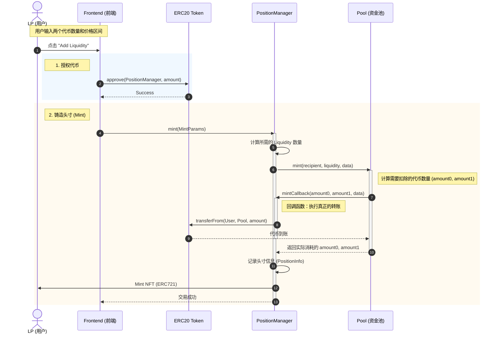
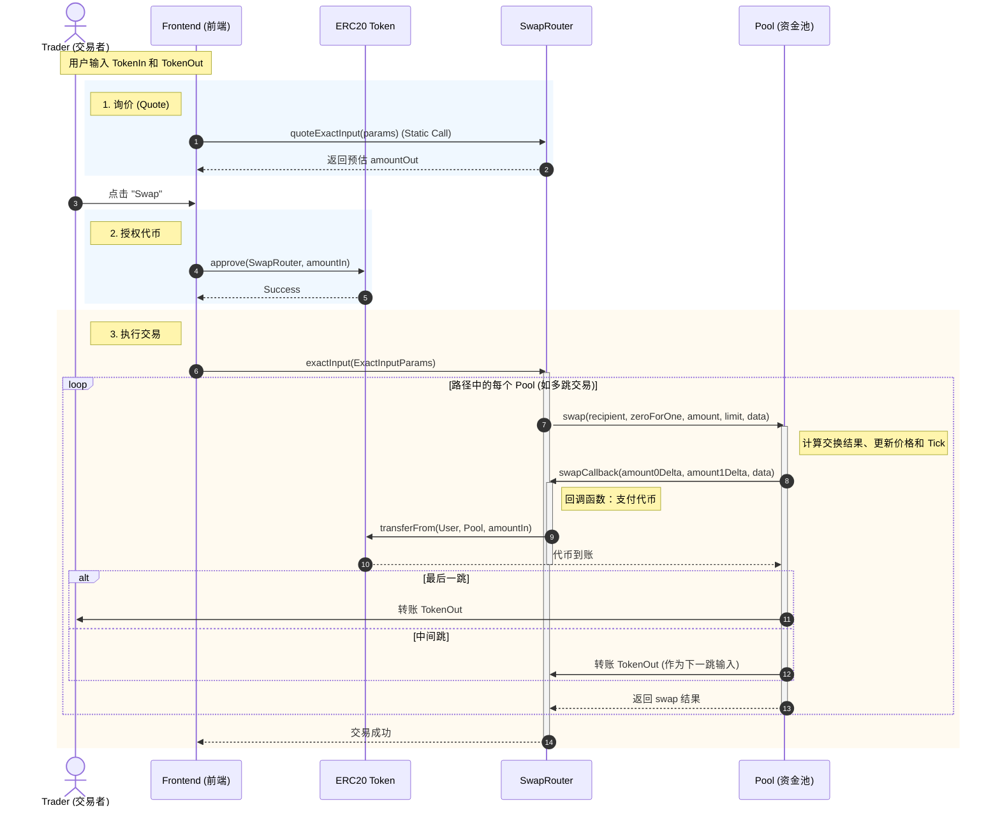
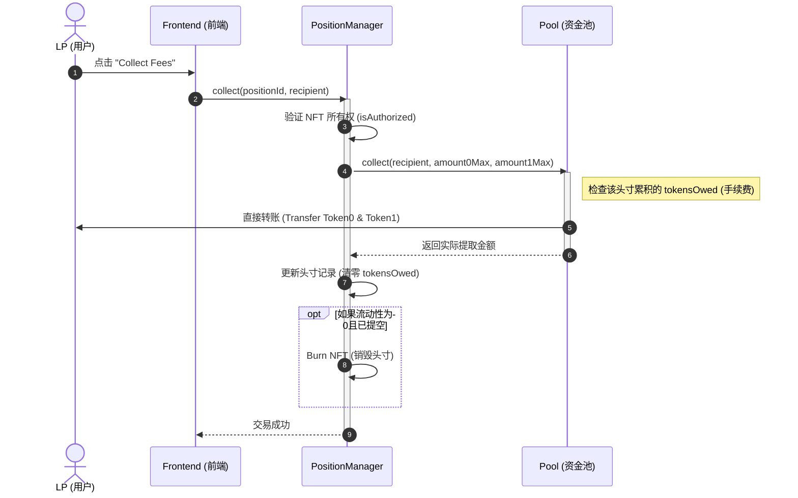

# DEX Project Sequence Diagrams

这些时序图描述了 DEX 项目中的核心业务流程。您可以直接在支持 Mermaid 的编辑器（如 Cursor, Obsidian, GitHub）中查看，也可以将其复制到 [draw.io](https://app.diagrams.net/) 中（使用 `Arrange -> Insert -> Advanced -> Mermaid`）生成可编辑的图表。

## 1. LP 添加流动性 (Add Liquidity)

LP 用户通过前端界面添加流动性，实际上是与 `PositionManager` 交互，最终获得一个代表头寸的 NFT。

## 2. 交易者 SWAP (Swap)

交易者通过 `SwapRouter` 进行代币兑换。

## 3. LP 收取手续费 (Collect Fees)

在集中流动性模型中，手续费不会自动复投，而是累积在头寸中，需要 LP 主动触发 `collect` 来提取。

